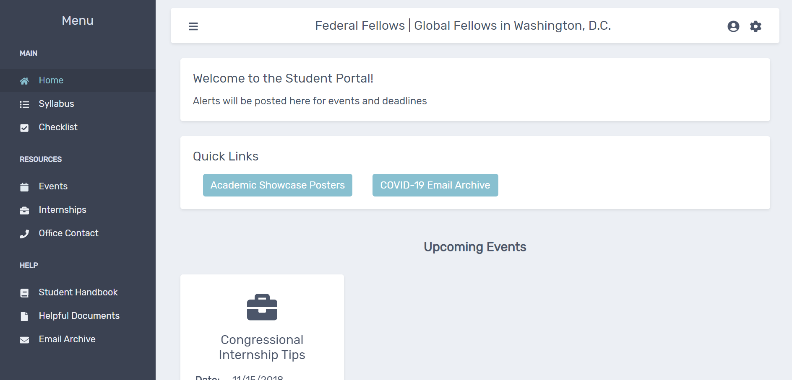

# FGSM Student Portal

     
FGSM portal Front-End demo

* The FGSM student portal is a **complete UX/UI re-design** of the University of
  Maryland's Federal and Global Fellows student portal
* The orginal front-end was written in HTML/CSS and has been **rewritten from
  the ground up** in React.js
* This project was written with support from **u/minersail** and **Matvey Stepanov**
  
## Features

* **Responsive UX/UI** including flipable Event Cards, descriptive Internship modals,
  a student checklist for uploading documents, student profile, staff directory
  page (Office Contact) among others
* Custom React **useAPI hook** designed to GET data from a PHP backend (attached to a 
  mySQL database). The **useAPI hook** will automatically POST data back to the database
  once changes have been made, leading to incredibly responsive pages that can be 
  updated on the fly
* Menu component which wraps every page. the Menu takes data from a JSON file
  which determines sidebar links, icons, etc. This allows for **maximum resuability**.
    * The Menu component sends onClose to props.children[0] which allows the
      menu bar to be changed easily

  
 
<a href="http://mgfalzon.github.io/student-portal" target="_blank">Live Demo</a>

<h4 align="center">Preview</h4>

  

